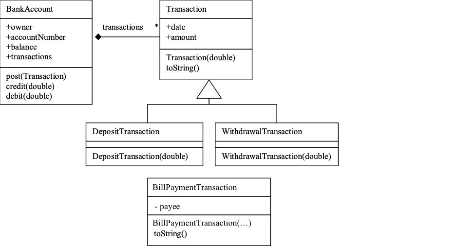

# Final version to send to Eteration

I have finalize the assignment that I am given by you. Model was sent to me from Eteration is below

## Task 1: Implement and test the model
For the task#1 I have added below code and tested it from DemoApplication.java file.

    BankAccount account = new BankAccount("Jim", 12345);
    account.post(new DepositTransaction(1000));
    account.post(new WithdrawalTransaction(200));
    account.post(new PhoneBillPaymentTransaction("Vodafone", "5423345566", 96.50));
    assertEquals(account.getBalance(), 703.50, 0.0001)

### BONUS Task 1: Find a better implementation alternative
For the BONUS Task#1 
Firstly, I thought to use factory design pattern to solve the problem of the transactions. I was thinking that I can create a transaction factory for all the future transaction types than I decided not to do that. 
I have implemented a solution that only add an enumaration for all the transaction types and inherited the BillPayment class from only WithdrawalTransaction class since it is a type of withdrawal and it takes 3 different arguments which "payee", "description" and amount
that way was enough to solve this problem in a simple manner.

## Task 2:  Provide a REST API using Spring Rest Controllers and TEST

For the task#2 I have added 3 files ( ResponseDeposit.json, ResponseWithdrawal.json, ResponseGetAccount.json ) for postman request and example responses to satify below needs 

To deposit money into an account, one would use:

    curl --location --request POST 'http://localhost:8080/account/v1/credit/669-7788' \
    --header 'Content-Type: application/json' \
    --header 'Accept: application/json' \
    --data-raw '    {
            "amount": 1000.0
        }'

    response would be (200):
    {
        "status": "OK",
        "approvalCode": "67f1aada-637d-4469-a650-3fb6352527ba"
    }

To withdraw money:

    curl --location --request POST 'http://localhost:8080/account/v1/debit/669-7788' \
    --header 'Content-Type: application/json' \
    --header 'Accept: application/json' \
    --data-raw '    {
            "amount": 50.0
        }'

    response would be (200):
    {
        "status": "OK",
        "approvalCode": "a66cce54-335b-4e46-9b49-05017c4b38dd"
    }

To get the current account data, one would use:

    curl --location --request GET 'http://localhost:8080/account/v1/669-7788'

    response would be:

    {
        "accountNumber": "669-7788",
        "owner": "Kerem Karaca",
        "balance": 950.0,
        "createDate": "2020-03-26T06:15:50.550+0000",
        "transactions": [
            {
                "date": "2020-03-26T06:16:03.563+0000",
                "amount": 1000.0,
                "type": "DepositTransaction",
                "approvalCode": "67f1aada-637d-4469-a650-3fb6352527ba"
            },
            {
                "date": "2020-03-26T06:16:35.047+0000",
                "amount": 50.0,
                "type": "WithdrawalTransaction",
                "approvalCode": "a66cce54-335b-4e46-9b49-05017c4b38dd"
            }
        ]
    }

## Further Information
I could have use Lombok library for all the getters and setters for the classes but I decided not to use it because I was not sure if you wanted to see it

